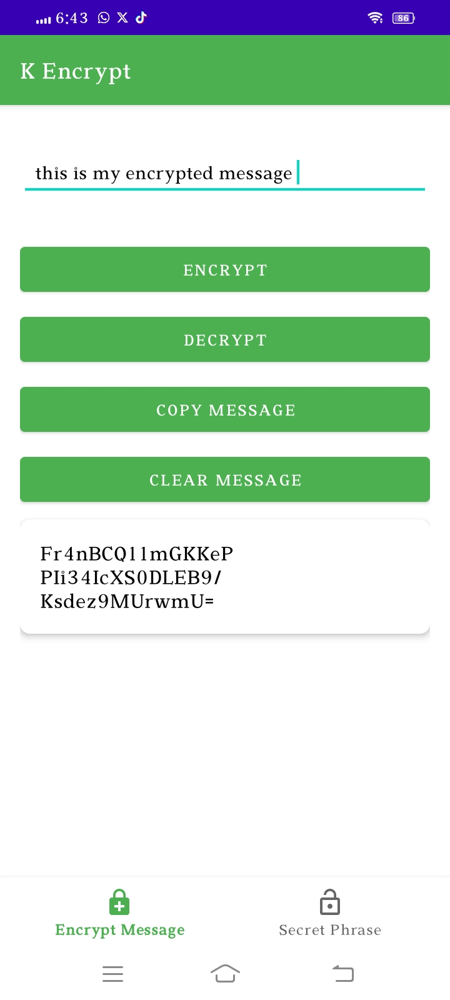

# k-encrypt

**k-encrypt** is an Android app that uses Advanced Encryption Standard (AES) to securely encrypt your messages. It offers flexibility in key management, allowing you to generate new encryption keys or use your own.

## Features
- **AES Encryption:** Industry-standard encryption for secure messaging.
- **Key Management:** Generate new encryption keys or use your own custom key.
- **User-Friendly Interface:** Intuitive design for ease of use.
- **Seamless Messaging:** Easily encrypt and decrypt messages.

## Screenshots

Here are some screenshots of the k-encrypt app:

  
  
  

## Installation

To install and run k-encrypt on your Android device:

1. **Download the APK:**
   - [k-encrypt APK](https://github.com/iamkahmadi/k-encrypt/raw/master/K%20Encrypt.apk)

2. **Install the APK:**
   - Enable installation from unknown sources in your device settings.
   - Open the downloaded APK file and follow the prompts to install.

## Usage

1. **Open the k-encrypt app on your Android device.**
2. **Select or generate an encryption key:**
   - **Generate New Key:** Use the app's built-in feature to generate a new encryption key.
   - **Use Your Own Key:** Enter your custom encryption key if you prefer.
3. **Enter your message into the input field.**
4. **Tap 'Encrypt' to encode your message using AES with the selected key.**
5. **Share the encrypted message with your contacts.**
6. **Your contacts can use the app to decrypt the message with the correct key.**

## Contributing

We welcome contributions! To contribute to k-encrypt:

1. **Fork the repository.**
2. **Create a new branch for your changes.**
3. **Commit your changes and push to the new branch.**
4. **Open a pull request describing your changes.**

## Contact

For questions or feedback, please contact [iamkahmadi@gmail.com](mailto:iamkahmadi@gmail.com).

